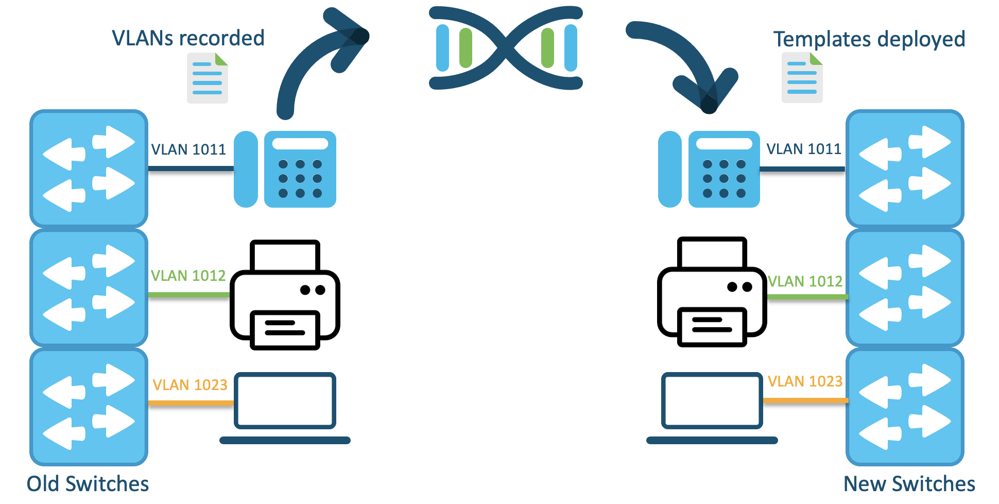

# DNAC Template VLAN Provisioning
This prototype is built to assist in the process of migrating to new switches that are connected to DNA Center. This prototype provides a way to automate the provisioning of VLANs on the new switches depending on which devices are plugged into the new switch.



## Contacts
* Danielle Stacy

## Solution Components
* DNA Center
* Python 3.9

## Prerequisites
- **Client MAC Addresses**: This code depends on a list of the MAC addresses already being provided. Before running this code, it is important to find and note the MAC addresses of the clients in this network. As the code is written, the MAC addresses are expected to be listed in the mac_addresses.json file.

## Installation/Configuration

1. Clone this repository with `git clone https://github.com/gve-sw/gve_devnet_dnac_template_vlan_provisioning` and open the directory.
2. Add the IP address, username, and password of your DNA Center instance to env.py. Additionally, add the project name of the project where you would like to add new templates in this file.
```python
env = {
    "base_url": "enter url of DNAC here",
    "username": "enter username of DNAC here",
    "password": "enter password of DNAC here"
}

project_name = "enter name of project you want templates to go in here"
```
3. Add the MAC addresses found in the Prerequisites section to the mac_addresses.json file.
```
{
    "mac_addresses": [
        "enter mac addresses of clients here",
        "enter mac addresses of clients here"
    ]
}
```
4. Set up a Python virtual environment. Make sure Python 3 is installed in your environment, and if not, you may download Python [here](https://www.python.org/downloads/). Once Python 3 is installed in your environment, you can activate the virtual environment with the instructions found [here](https://docs.python.org/3/tutorial/venv.html).
5. Install the requirements with `pip install -r requirements.txt`

## Usage

The functions that make the API calls to DNA Center are located in dnac.py. The find_vlans.py file should be run before the physical migration occurs to find the VLANs where the clients are associated on the old switches. This information is then written to the file mac_to_vlan.json. Once the old switches have been replaced with the new switches and all the clients have been migrated over, run the deploy_templates.py file to create templates that configure the VLANs on the switches and deploy those templates.

To run the find_vlans.py code, run the command `python3 find_vlans.py`.

To run the deploy_templates.py code, run the command `python3 deploy_templates.py`.

# Screenshots


Output from GET device details


Output from creating and deploying template


Template created from script


### LICENSE

Provided under Cisco Sample Code License, for details see [LICENSE](LICENSE.md)

### CODE_OF_CONDUCT

Our code of conduct is available [here](CODE_OF_CONDUCT.md)

### CONTRIBUTING

See our contributing guidelines [here](CONTRIBUTING.md)

#### DISCLAIMER:
<b>Please note:</b> This script is meant for demo purposes only. All tools/ scripts in this repo are released for use "AS IS" without any warranties of any kind, including, but not limited to their installation, use, or performance. Any use of these scripts and tools is at your own risk. There is no guarantee that they have been through thorough testing in a comparable environment and we are not responsible for any damage or data loss incurred with their use.
You are responsible for reviewing and testing any scripts you run thoroughly before use in any non-testing environment.
